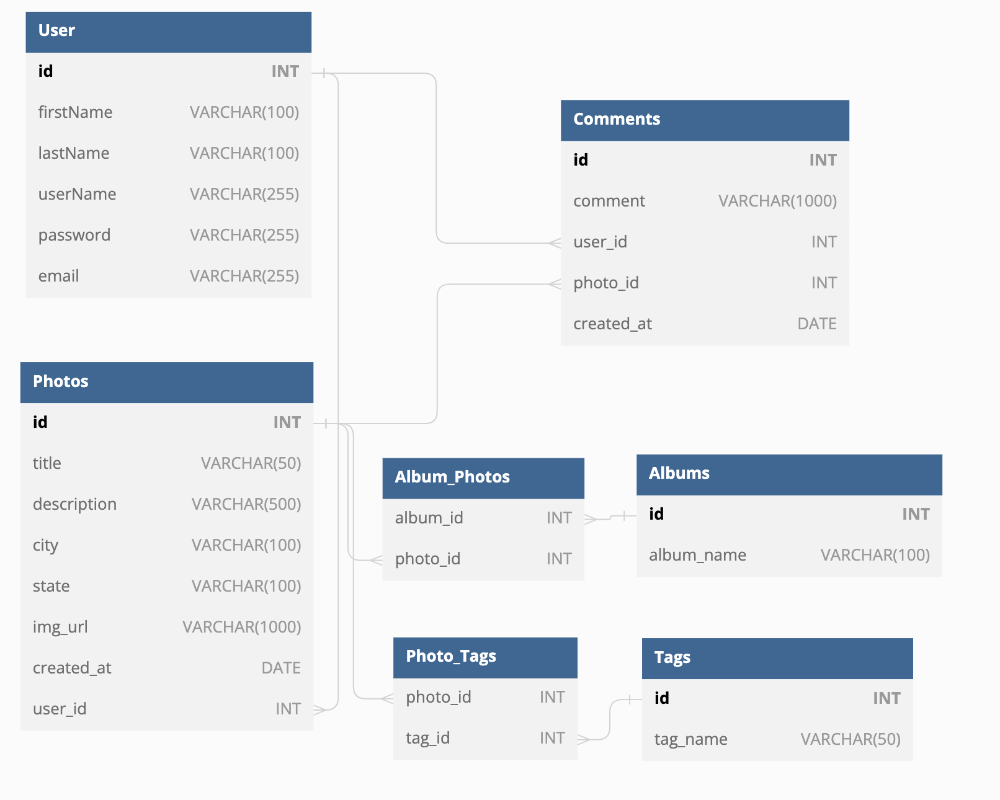

# PixelPeek

---

## DB Schema



---

## Backend endpoints:

## Photos

### - Get all photos

Returns all the photos

- Require Authentication: false
- Request
  - Method: GET
  - URL: /api/photos
  - Body: none
- Successful Response
  - Status Code: 200
  - Headers:
    - Content-Type: application/json
  - Body:

```json
  {
    "Photos": [
      {
        "id": 1,
        "user_id": 1,
        "title": "DogsAndCats",
        "description": "nice animals",
        "city": "Los Angeles",
        "state": "California",
        "country": "United States"
        "img_url": "!!REPLACE WITH S3 BUCKET!!",
        "created_at": "02/02/2023"
      }
    ]
  }
```

### - Get details of a photo by id

Returns the details of a spot specified by its id.

- Require Authentication: false
- Request
  - Method: GET
  - URL: /api/photos/:photoId
  - Body: none
- Successful Response
  - Status Code: 200
  - Headers:
    - Content-Type: application/json
  - Body:

```json
{
  "id": 1,
  "user_id": 1,
  "title": "DogsAndCats",
  "description": "nice animals",
  "city": "Los Angeles",
  "state": "California",
  "img_url": "!!REPLACE WITH S3 BUCKET!!",
  "created_at": "02/02/2023"
}
```

- Error response: Couldn't find a Photo with the specified id
  - Status Code: 404
  - Headers:
    - Content-Type: application/json
  * Body:

```json
{
  "message": "Photo couldn't be found",
  "statusCode": 404
}
```

### - Create a new photo

Creates and returns a new photo image

- Require Authentication: true
- Request

  - Method: POST
  - URL:/api/photos
  - Headers:
    - Content-Type: application/json
  - Body:

```json
{
  "title": "DogsAndCats",
  "description": "nice animals",
  "city": "Los Angeles",
  "state": "California"
}
```

- Successful Response
  - Status Code: 201
  - Headers:
    - Content-Type: application/json
  - Body:

```json
{
  "id": 1,
  "user_id": 1,
  "title": "DogsAndCats",
  "description": "nice animals",
  "city": "Los Angeles",
  "state": "California",
  "created_at": "02/02/2023"
}
```

- Error Response Body validation error

  - Status Code: 400
  - Headers:
    - Content-Type: application/json
  - Body:

```json
{
  "message": "Validation Error",
  "statusCode": 400,
  "errors": {
    "title": "Photo title must be less than 50 characters",
    "city": "City is required",
    "state": "State is required",
    "country": "Country is required",
    "description": "Description is required"
  }
}
```

### - Update/Edit Photo

Updates and returns an existing photo.

- Require Authentication: true
- Require proper authorization: Spot must belong to the current user
- Request
  - Method: PUT
  - URL: /api/photos/:photoId
  - Headers:
    - Content-Type: application/json
  - Body:

```json
{
  "title": "DogsAndCats",
  "description": "nice animals",
  "city": "Los Angeles",
  "state": "California"
}
```

- Successful Response
  - Status Code: 200
  - Headers:
    - Content-Type: application/json
  - Body:

```json
{
  "id": 1,
  "user_id": 1,
  "title": "DogsAndCats",
  "description": "nice animals",
  "city": "Los Angeles",
  "state": "California",
  "created_at": "02/02/2023"
}
```

- Error Response Body validation error

  - Status Code: 400
  - Headers:
    - Content-Type: application/json
  - Body:

```json
{
  "message": "Validation Error",
  "statusCode": 400,
  "errors": {
    "title": "Photo title must be less than 50 characters",
    "city": "City is required",
    "state": "State is required",
    "country": "Country is required",
    "description": "Description is required"
  }
}
```

- Error response: Couldn't find a photo with the specified id

  - Status Code: 404
  - Headers:
    - Content-Type: application/json
  - Body:

  ```json
  {
    "message": "Photo couldn't be found",
    "statusCode": 404
  }
  ```

### - Delete a Photo

Deletes an existing photo.

- Require Authentication: true
- Require proper authorization: Photo must belong to the current user
- Request
  - Method: DELETE
  - URL:/api/photos/:photoId
  - Body: none
- Successful Response

  - Status Code: 200
  - Headers:

    - Content-Type: application.json
    - Body:

    ```json
    {
      "message": "Successfully deleted",
      "statusCode": 200
    }
    ```

- Error response: Couldn't find a Photo with the specified id
  - Status Code: 404
  - Headers:
    - Content-Type: application/json
  - Body:
  ```json
  {
    "message": "Photo couldn't be found",
    "statusCode": 404
  }
  ```

---

## Albums

### - Get details from album by album id

Returns photos from an album by album Id

- Require Authentication: false
- Request
  - Method: GET
  - URL: /api/album/:albumId
  - Body: none
- Successful Response
  - Status Code: 200
  - Headers:
    - Content-Type: application/json
  - Body:
  ```
  {
    {
      "id": 1,
      "album_id": 1,
      "album_name": "DogsAndCats"
    }
  }
  ```

* Error response: Couldn't find an Album with the specified id
  - Status Code: 404
  - Headers:
    - Content-Type: application/json
  * Body:
  ```
  {
    "message": "Album couldn't be found",
    "statusCode": 404
  }
  ```

### - Get all photos from an album

Returns photos from an album by album Id

- Require Authentication: false
- Request
  - Method: GET
  - URL: /api/album/:albumId/photos
  - Body: none
- Successful Response
  - Status Code: 200
  - Headers:
    - Content-Type: application/json
  - Body:
  ```
  {
    "Photos": [
      {
        "id": 1,
        "user_id": 1,
        "title": "DogsAndCats",
        "description": "nice animals",
        "city": "Los Angeles",
        "state": "California",
        "country": "United States"
        "img_url": "!!REPLACE WITH S3 BUCKET!!",
        "created_at": "02/02/2023"
      }
    ]
  }
  ```

### - Create an album

Creates an empty album

- Require Authentication: true
- Request

  - Method: POST
  - URL: /api/album
  - Body:

  ```
  {
    "album_name": "DogsAndCats"
  }
  ```

- Successful Response

  - Status Code: 200
  - Headers:
    - Content-Type: application/json
  - Body:

  ```
  {
    message: "Successfully Created"
  }
  ```

- Error Response: Body validation error
  - Status Code: 400
  - Headers:
    - Content-Type: application/json
  - Body:
  ```
  {
    "message": "Validation Error",
    "statusCode": 400,
    "errors": {
      "name": "Name must be 60 characters or less"
    }
  }
  ```

### - Add photo(s) to album

Add photo(s) to an album by photo id

- Require Authentication: true
- Require proper authorization: Current User must be the owner of album and owner of photos
- Request

  - Method: PUT
  - URL: /api/album/:albumId
  - Body:

  ```
  {
    "Photos": [
      {
        photoId: 1
      },
      {
        photoId: 2
      }
    ]
  }
  ```

- Successful Response

  - Status Code: 200
  - Headers:
    - Content-Type: application/json
  - Body:

  ```
  {
    "message": "Successfully Added
  }
  ```

- Error Response

  - Status Code: 404
  - Headers:
    - Content-Type: application/json
  - Body:

  ```
  {
    message: "Couldn't find photo with the specified id"
  }
  ```

- Authentication Error Response
  - Status Code: 403
  - Headers:
    - Content-Type: application/json
  - Body:
  ```
  {
    message: "Forbidden"
  }
  ```

### - Delete an album

Delete an album by id

- Require Authentication: true
- Require proper authorization: Current User must be the owner of album
- Request

  - Method: DELETE
  - URL: /api/album/:albumId
  - Body: none

  ```
  {
    "album_name": "DogsAndCats"
  }
  ```

- Successful Response

  - Status Code: 200
  - Headers:
    - Content-Type: application/json
  - Body:

  ```
  {
    message: "Successfully Deleted"
  }
  ```

- Error Response

  - Status Code: 404
  - Headers:
    - Content-Type: application/json
  - Body:

  ```
  {
    message: "Couldn't find album with the specified id"
  }
  ```

- Authentication Error Response
  - Status Code: 403
  - Headers:
    - Content-Type: application/json
  - Body:
  ```
  {
    message: "Forbidden"
  }
  ```

## Comments

## Tags

### - Get all tags

Returns all the Tags

- Require Authentication: false
- Request
  - Method: GET
  - URL: /api/tags
  - Body: none
- Successful Response
  - Status Code: 200
  - Headers:
    - Content-Type: application/json
  - Body:
  ```
  {
    "Tags": [
      {
        "id": 1,
        "name": "Funny",
      },
      {
        "id": 2,
        "name": "Romantic",
      }
    ]
  }
  ```

### - Get all tags attatched to an photo

Returns all the Tags for one photo

- Require Authentication: false
- Request
  - Method: GET
  - URL: /api/photos/:photoId/tags
  - Body: none
- Successful Response
  - Status Code: 200
  - Headers:
    - Content-Type: application/json
  - Body:
  ```
  {
    "PhotoId": 5
    "Tags": [
      {
        "id": 1,
        "name": "Funny",
      },
      {
        "id": 2,
        "name": "Romantic",
      }
    ]
  }
  ```

* Error response: Couldn't find a Photo with the specified id
  - Status Code: 404
  - Headers:
    - Content-Type: application/json
  * Body:
  ```
  {
    "message": "Photo couldn't be found",
    "statusCode": 404
  }
  ```

### - Get tag by id

Returns the Tag by the associated Tag Id

- Require Authentication: false
- Request
  - Method: GET
  - URL: /api/tags/:tagId
  - Body: none
- Successful Response
  - Status Code: 200
  - Headers:
    - Content-Type: application/json
  - Body:
  ```
  {
    "id": 1,
    "name": "Funny",
  }
  ```

* Error response: Coulnd't find a Tag with the specified id
  - Status Code: 404
  - Headers:
    - Content-Type: application/json
  * Body:
  ```
  {
    "message": "Tag couldn't be found",
    "statusCode": 404
  }
  ```

### - Create a new tag

Creates a new tag

- Require Authentication: True
- Request
  - Method: POST
  - URL: /api/tags
  - Body:
  ```
  {
    "name": "Stunning",
  }
  ```
- Successful Response
  - Status Code: 200
  - Headers:
    - Content-Type: application/json
  - Body:
  ```
  {
    "id": 3,
    "name": "Stunning",
  }
  ```

* Error response: That tag already exists
  - Status Code: 404
  - Headers:
    - Content-Type: application/json
  * Body:
  ```
  {
    "message": "That Tag already exists",
    "statusCode": 400
  }
  ```

### - Add a tag to a photo

Adds a tag to a photo

- Require Authentication: True
- Require proper authorization: Photo must belong to the current user
- Request

  - Method: POST
  - URL: /api/photos/:photoId/tags
  - Body:

  ```
  {
    "tagId": 1,
  }
  ```

- Successful Response
  - Status Code: 200
  - Headers:
    - Content-Type: application/json
  - Body:
  ```
  {
    "message": "Tag successfully added",
    "statusCode": 200
  }
  ```

* Error response: Couldn't find a Tag with the specified id

  - Status Code: 404
  - Headers:
    - Content-Type: application/json

  * Body:

  ```
  {
    "message": "Tag couldn't be found",
    "statusCode": 404
  }
  ```

* Error response: Couldn't find a Photo with the specified id
  - Status Code: 404
  - Headers:
    - Content-Type: application/json
  * Body:
  ```
  {
    "message": "Photo couldn't be found",
    "statusCode": 404
  }
  ```

### - Delete a tag from a photo

Deletes a tag from a photo

- Require Authentication: True
- Require proper authorization: Photo must belong to the current user
- Request

  - Method: DELETE
  - URL: /api/photos/:photoId/tags
  - Body:

  ```
  {
    "tagId": 1,
  }
  ```

- Successful Response
  - Status Code: 200
  - Headers:
    - Content-Type: application/json
  - Body:
  ```
  {
    "message": "Tag successfully deleted",
    "statusCode": 200
  }
  ```

* Error response: Couldn't find a Tag with the specified id

  - Status Code: 404
  - Headers:
    - Content-Type: application/json

  * Body:

  ```
  {
    "message": "Tag couldn't be found",
    "statusCode": 404
  }
  ```

* Error response: Couldn't find a Photo with the specified id
  - Status Code: 404
  - Headers:
    - Content-Type: application/json
  * Body:
  ```
  {
    "message": "Photo couldn't be found",
    "statusCode": 404
  }
  ```

---

## User Stories

## - Users

### Sign Up

- As an unregistered and unauthorized user, I want to be able to sign up for the website via a sign-up form.
  - When I'm on the `/signup` page:
    - I would like to be able to enter my email, username, and preferred password on a clearly laid out form.
    - I would like the website to log me in upon successful completion of the sign-up form.
      - So that I can seamlessly access the site's functionality
  - When I enter invalid data on the sign-up form:
    - I would like the website to inform me of the validations I failed to pass, and repopulate the form with my valid entries (except my password).
    - So that I can try again without needing to refill forms I entered valid data into.

### Log in

- As a registered and unauthorized user, I want to be able to log in to the website via a log-in form.
  - When I'm on the `/login` page:
    - I would like to be able to enter my email and password on a clearly laid out form.
    - I would like the website to log me in upon successful completion of the lob-up form.
      - So that I can seamlessly access the site's functionality
  - When I enter invalid data on the log-up form:
    - I would like the website to inform me of the validations I failed to pass, and repopulate the form with my valid entries (except my password).
      - So that I can try again without needing to refill forms I entered valid data into.

### Demo User

- As an unregistered and unauthorized user, I would like an easy to find and clear button on both the `/signup` and `/login` pages to allow me to visit the site as a guest without signing up or logging in.
  - When I'm on either the `/signup` or `/login` pages:
    - I can click on a Demo User button to log me in and allow me access as a normal user.
      - So that I can test the site's features and functionality without needing to stop and enter credentials.

### Log Out

- As a logged in user, I want to log out via an easy to find log out button on the navigation bar.
  - While on any page of the site:
    - I can log out of my account and be redirected to a page displaying recent photos.
      - So that I can easily log out to keep my information secure.

## - Photos

### Create Photos

- As a logged in user, I want to be able to post new photos.
  - When I'm on the `/photos` page:
    - I can add and submit a new photo.
      - So that I can share my adventures, vacations or other photos with my friends.

### Viewing Photos

- As a logged in _or_ logged out user, I want to be able to view a selection of the most recent photos.

  - When I'm on the `/photos` page:
    - I can view all the uploaded photos currently on the site.
      - So that I can see photos that my friends or other users upload.

- As a logged in _or_ logged out user, I want to be able to view a specific photo and its associated comments.
  - When I'm on the `/photos/:photoId` page:
    - I can view the content included with the photo like the comments and location.
      - So that I can see photos that my friends or other users upload.

### Updating Photos

- As a logged in user, I want to be able to edit my photos by clicking an Edit button associated with the photo anywhere that the specific photo appears.
  - When I'm on the `/photos/:photoId` page:
    - I can click "Edit" to make permanent changes to photo I have posted.
      - So that I can fix any errors I make in my photo.

### Deleting Photos

- As a logged in user, I want to be able to delete my photos by clicking a Delete button associated with the photo in the single photo page that the photo appears in.
  - When I'm on the `/photos/:photoId` page:
    - I can click "Delete" to permanently delete a photo I have posted.
      - So that when I realize I shouldn't have included something, I can easily remove it.

---

## Frontend endpoints

## Wireframe
